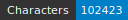
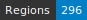
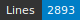
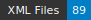

# HTRogène - Medieval Italian

   

## Introduction

HTRogène is an exploratory project funded by Biblissima+, aiming to develop generic models for automatic transcription of medieval and early modern manuscripts.  
This repository focuses on the Medieval Italian corpus, providing ground-truth data for Handwritten Text Recognition (HTR) and layout segmentation.  
The dataset is designed to support the creation of robust and reliable HTR models for Italian manuscripts.

| Shelfmark                                                     | Links                                              | Type   |   Century | Color Pages   |   Main Zones |   Lines |   Characters | Genre       |
|---------------------------------------------------------------|----------------------------------------------------|--------|-----------|---------------|--------------|---------|--------------|-------------|
| Rouen, Bibliothèque Municipale, Ms. Leber 1158                | [**B**](https://data.biblissima.fr/entity/Q236850) | prose  |        15 | ✓             |           12 |     250 |        12068 | Treatises   |
| Firenze, BNCF, Palatino 343                                   |                                                    | verse  |        15 | ✗             |           10 |     402 |        10950 | Narratives  |
| Paris, BnF, it. 1019                                          | [**B**](https://data.biblissima.fr/entity/Q57227)  | verse  |        15 | ✓             |           10 |     260 |         7706 | Poetry      |
| Cambridge. Harvard University Library, MS Typ 316             |                                                    | prose  |        15 | ✓             |           11 |     184 |         5901 | Treatises   |
| Strasbourg, Bibliothèque nationale et universitaire, Ms.1.808 | [**B**](https://data.biblissima.fr/entity/Q277247) | verse  |        15 | ✓             |            2 |     129 |         3662 | Narratives  |
| Oxford, Bodleian Library MS. Canon. Ital. 160                 |                                                    | verse  |        15 | ✗             |           10 |     190 |         5165 | Poetry      |
| Oxford, Bodleian Library, MS. Digby 94                        | [**B**](https://data.biblissima.fr/entity/Q213666) | verse  |        15 | ✓             |           10 |     278 |        11428 | Narratives  |
| Oxford, Bodleian Library MS. Canon. Ital. 49                  |                                                    | verse  |        15 | ✗             |           10 |     262 |         6851 | Narratives  |
| Oxford, Bodleian Library, MS. Canon. Ital. 260                |                                                    | prose  |        15 | ✓             |           10 |     343 |        13929 | Treatises   |
| Paris, BnF, it. 1729                                          | [**B**](https://data.biblissima.fr/entity/Q57455)  | prose  |        16 | ✗             |           22 |     595 |        24619 | Espistolary |

## Dataset Overview

The dataset comprises carefully selected manuscripts, each containing approximately 10 columns of text (equivalent to 5 bi-column pages or 10 single-column pages).  
The data adheres to the Segmonto guidelines, ensuring consistency and compatibility with other datasets following the same standards.  
Each image is accompanied by two XML files:

- Files suffixed with `.chocomufin.xml` are normalized for compliance with broader datasets.
- The other XML files contain repository-specific information.

We recommend using the normalized `.chocomufin.xml` files for most applications.

### Total number of pages

89

### Regions

- MainZone (107)
- NumberingZone (69)
- GraphicZone (12)
- StampZone (1)
- RunningTitleZone (19)
- DropCapitalZone (20)
- MarginTextZone (22)
- DigitizationArtefactZone (46)

### Lines

- DefaultLine (2849)
- HeadingLine (34)
- InterlinearLine (10)

## Funding and Support

This project is funded by Biblissima+, an observatory for medieval and Renaissance written cultural heritage.  
Biblissima+ focuses on the study of the circulation of books and the transmission of texts from the 8th to 18th centuries.  
Learn more at the [Biblissima+ project page](https://projet.biblissima.fr/fr/appels-projets/projets-retenus/htrogene).

## License

This dataset is licensed under the Creative Commons Attribution 4.0 International License (CC BY 4.0).  
You are free to share and adapt the material, provided appropriate credit is given.

## Citation

If you use this dataset in your research, please cite it as follows:

<!--Alba, Rachele; Rubin, Giorgia. (2023). HTRogene, Medieval Italian corpus of ground-truth for Handwritten Text Recognition and Layout Segmentation. Zenodo. https://doi.org/10.5281/zenodo.8272728-->

## Acknowledgments

We extend our gratitude to the transcribers and supervisors who contributed to the creation of this dataset.  

Special thanks to Biblissima+ for their financial support and commitment to advancing the study of medieval manuscripts.

For more information about the HTRogène project and other related resources, please visit the [Biblissima+ project page](https://projet.biblissima.fr/fr/appels-projets/projets-retenus/htrogene).

